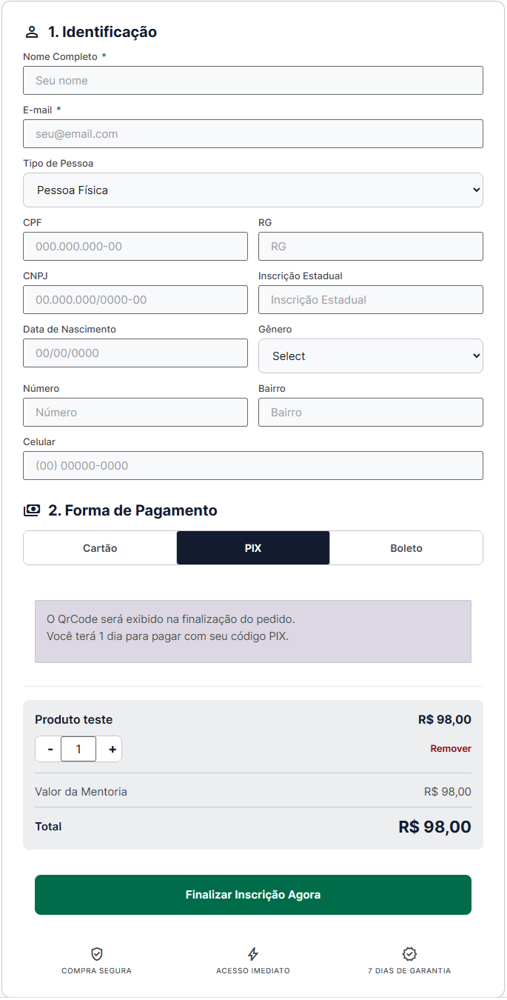

# Checkout GVNTRCK

Checkout personalizado para WooCommerce que renderiza um card de checkout em qualquer pagina por shortcode. O plugin usa o fluxo nativo do WooCommerce, mantendo compatibilidade com gateways de pagamento ativos.



## O que o plugin faz

- Cria um checkout responsivo em formato de card.
- Permite configurar campos de identificacao, textos, cores e selos.
- Permite mapear abas de pagamento como Cartao, PIX e Boleto para gateways do WooCommerce.
- Pode funcionar como checkout de produto unico ou como checkout geral do carrinho.
- Mantem compatibilidade com HPOS do WooCommerce.

## Shortcodes

### `[checkout-gvntrck]`

Exibe o checkout de produto unico configurado no painel do plugin.

Use quando quiser criar uma pagina de oferta para um produto especifico. Ao abrir a pagina, o plugin adiciona automaticamente ao carrinho o produto definido em **Checkout GVNTRCK > Geral**.

### `[checkout-gvntrck product_id="123"]`

Exibe o checkout de produto unico usando o produto informado no atributo `product_id`.

Use quando quiser reutilizar o mesmo checkout em paginas diferentes, cada uma com um produto especifico. Troque `123` pelo ID real do produto no WooCommerce.

Exemplo:

```text
[checkout-gvntrck product_id="456"]
```

### `[checkout-gvntrck-geral]`

Exibe o checkout geral do carrinho atual.

Use em lojas tradicionais, quando o cliente ja adicionou produtos ao carrinho antes de chegar ao checkout. Esse modo mostra os itens do carrinho, permite alterar quantidade, remover produtos e usar cupom, se a opcao estiver ativa.

## Como usar

1. Envie a pasta do plugin para `/wp-content/plugins/`.
2. Ative o plugin no painel do WordPress.
3. Acesse **Checkout GVNTRCK** no menu lateral.
4. Configure produto, gateways, campos, cores, textos e pagina de obrigado.
5. Crie ou edite uma pagina no WordPress.
6. Insira um dos shortcodes acima no conteudo da pagina.
7. Publique a pagina e teste o checkout com um gateway ativo.

## Requisitos

- WordPress 5.8 ou superior.
- PHP 7.4 ou superior.
- WooCommerce 6.0 ou superior ativo.

